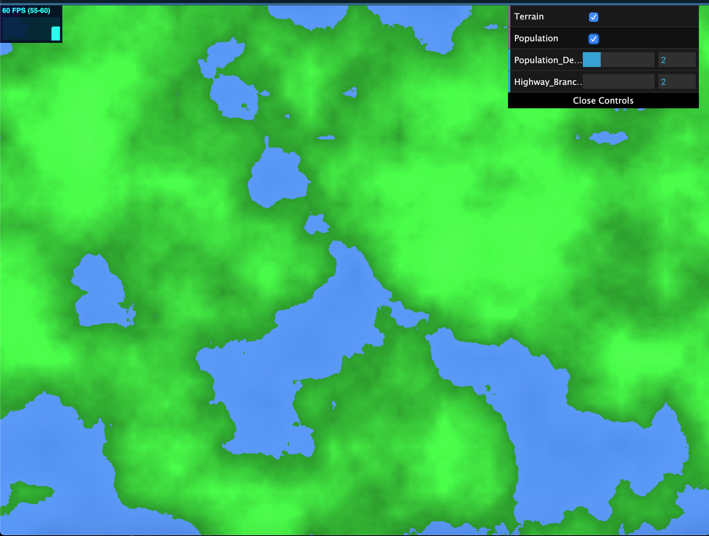
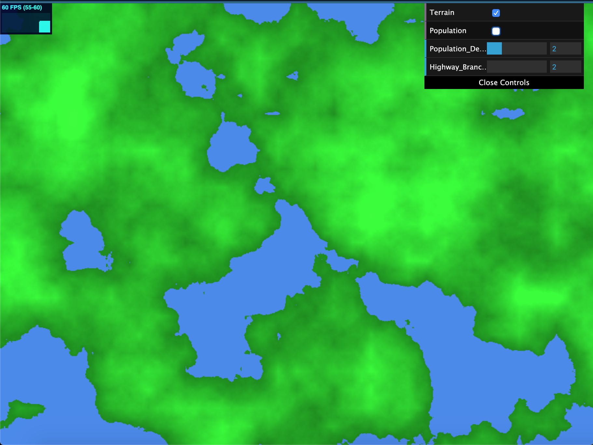
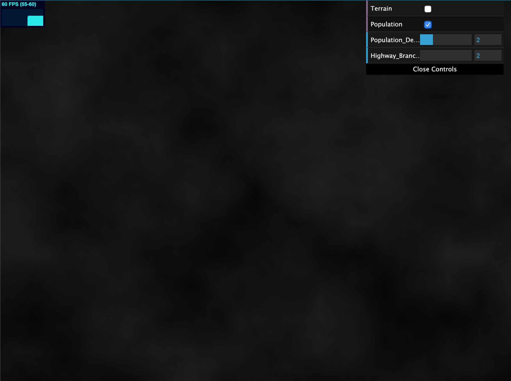

# Homework 5: Road Generation
## Catherine Yang, PennKey: catyang

## https://catyang97.github.io/hw05-road-generation/

---
## References
- Procedural City Generation Paper: https://github.com/catyang97/hw05-road-generation/blob/master/proceduralCityGeneration.pdf
- Emily Vo's City Forgery Project for Intersections: https://github.com/emily-vo/city-forgery/blob/master/src/voronoi.js
- IQ's Voronoi Noise: https://www.shadertoy.com/view/Xd23Dh
- CIS 460 HW4: referenced to create the texture for the map in the CPU

---
## Implementation
- RoadMap Class: The RoadMap class contains all of the information for the road generation. It keep track of a stack of Turtles, the map containing terrain/population texture data, and arrays containing edges, highway, intersections, and transformations to render. The turtle starts at a random location on the map. 
  - First highways are drawn by using basic road branching, the main roads follow population density to decide which direction to take. We generate two test turtles and decide which direction to rotate based on population. The highways branch should branch in 2 or 3 directions based on user input (to be completed). 
  - Then, given the highway roads generated, we generate grids. The grids follow the checkered road networking rules so that the roads align with a global direction vector. This is done by sending a turtle in the forward direction, one left, and one right at 90 degree angles (to be completed).
  - We get the transformation data from each edge that is generated so that it can be rendered.
  - Only the highways should be able to cross water (check using the inWater function).
- Turtle Class: The Turtle keeps track of its orientation and position. The orientation is represented with a quat and a global up vector. The position is adjusted by moving along the direction/orientation of the turtle. This class also outputs the turtle's transformation in the form of a matrix, as well as a fish's transformation.
- Edge Class: The edge contains the start and end points, as well as the width of the edge. Each edge has a transformation matrix.
- Intersection Class: The intersection contains the point of intersection. We keep track of all the intersections so that we can check intersections as we add decide how/where to add edges.
- Instance Rendering: A collection of transformation and color data is passsed to the GPU to draw the edges using instanced rendering of square geometry.
- Texture: The map with the terrain and population information is in main.ts to connect to the GPU/the shaders where the terrains were create. This info is then passed as a Unit8Array of pixel data to the RoadMap so we can access it for the road generation. The population and terrain maps are laid over each other and can be toggled to only show one or the either.

---
## Next/Unfinished Steps
- I was unable to get the squares to render on the screen so none of the roads are visible.
- Highway generation: add the ability to branch in 2 or 3 ways. Only highways should be able to cross water.
- Grid generation: incomplete
---

## Map with Population and Terrain

## Map with no Population

## Map with no Terrain
